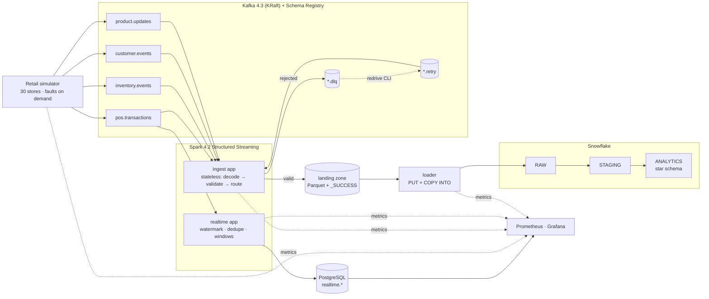
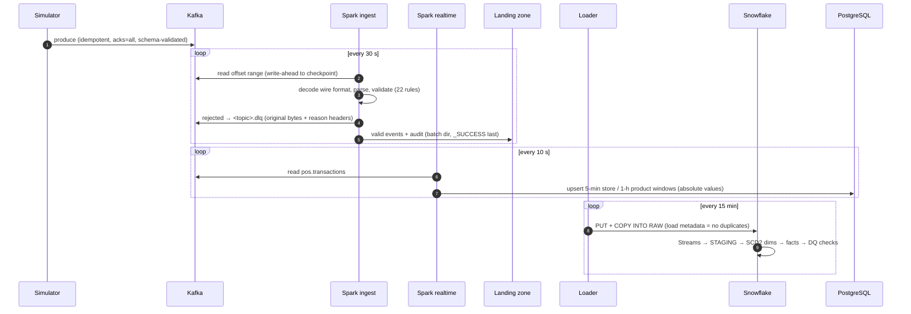

# Real-Time Retail Data Platform

[](https://github.com/aiman-che-razani/retail-streaming-platform/actions/workflows/ci.yml)

A production-oriented streaming data platform for **KedaiKita Retail**, a fictional 30-outlet Malaysian convenience chain. It is built to be run by one developer on one laptop. Snowflake is the only cloud dependency.

```
Retail simulator ─► Kafka + Schema Registry ─► Spark Structured Streaming ─► landing zone ─► Snowflake RAW ─► STAGING ─► ANALYTICS ─► SQL
                                                        └─► PostgreSQL (real-time aggregates) ─► Grafana
```

It demonstrates the parts of data engineering that tutorials usually skip:

- **Contracts:** JSON Schema with Schema Registry and a CI compatibility gate.
- **Delivery and idempotency:** at-least-once delivery with idempotent sinks, giving exactly-once effects.
- **Validation and dead-lettering:** validation and DLQ routing, with redrive.
- **Event time:** event-time windows, watermarks and late data.
- **Dimensional modelling:** SCD2 with deterministic keys and late-arriving dimensions.
- **Reconciliation:** from Kafka to the facts.
- **Observability:** Prometheus, Grafana and alerts.
- **Failure handling:** failure-mode engineering.
- **Cost control:** Snowflake cost controls.

---

## Contents

1. [Purpose](#1-purpose) · 2. [Architecture](#2-architecture) · 3. [Technology stack](#3-technology-stack) · 4. [Data flow](#4-data-flow) · 5. [Repository structure](#5-repository-structure) · 6. [Local installation](#6-local-installation) · 7. [Configuration](#7-configuration) · 8. [Starting infrastructure](#8-starting-infrastructure) · 9. [Running producers](#9-running-producers) · 10. [Running Spark jobs](#10-running-spark-jobs) · 11. [Configuring Snowflake](#11-configuring-snowflake) · 12. [Running tests](#12-running-tests) · 13. [Monitoring](#13-monitoring) · 14. [Troubleshooting](#14-troubleshooting) · 15. [Architectural decisions](#15-architectural-decisions) · 16. [Production considerations](#16-production-considerations)

---

## 1. Purpose

The platform turns a stream of retail events into two products:

| Product | Latency | Store | Used for |
|---|---|---|---|
| Operational real-time metrics (revenue per store per 5 min, units per product per hour) | seconds | PostgreSQL → Grafana | store operations |
| Governed analytical warehouse (star schema with history) | minutes | Snowflake | revenue, basket, product, store, inventory analysis |

The platform simulates realistic retail data:

- sales baskets from 30 stores, drawn from a 500-SKU catalog, with around 40% guest checkouts;
- stock depletion, reorder-point replenishment and shrinkage;
- product price and category changes, and customer tier changes and moves;
- on demand, faults: malformed, invalid, duplicate, late and unknown-product events.

**Status:** all 13 phases are complete, with 160+ automated tests running in CI.

**Snowflake caveat:** the Snowflake SQL is statically verified but has not been executed against a live account; see [production review](docs/review/production-review.md).

## 2. Architecture



The key design choices:

- **Two Spark apps.** The **ingest** path is stateless, so a late sale is never dropped from the warehouse. The **realtime** path is stateful: it keeps memory bounded with a watermark and accepts that very late data is excluded from its aggregates ([ADR-004](docs/adr/ADR-004-spark-structured-streaming.md)).
- **Spark never talks to Snowflake.** A landing zone and a scheduled loader decouple the failure domains. The Snowflake warehouse runs only in short windows, so the cost is about 0.16 credits per hour while the pipeline runs and nothing when idle ([ADR-010](docs/adr/ADR-010-snowflake-loading.md)).
- **Idempotent at every sink.** Any component can crash at any moment without losing or duplicating facts ([ADR-007](docs/adr/ADR-007-delivery-and-idempotency.md)).

The full design, with requirements, boundaries and the deployment view, is in [docs/architecture/overview.md](docs/architecture/overview.md).

## 3. Technology stack

| Concern | Choice |
|---|---|
| Language | Python 3.12 (typed, `mypy --strict`), SQL |
| Streaming backbone | Apache Kafka 4.3 (KRaft), Confluent Schema Registry 8.3, kafbat UI |
| Contracts | JSON Schema draft-07, `BACKWARD_TRANSITIVE` |
| Stream processing | PySpark 4.2 Structured Streaming, RocksDB state store, JDK 21 |
| Warehouse | Snowflake (Streams, Tasks, Snowflake Scripting procedures, internal stage, COPY) |
| Real-time store | PostgreSQL 17 |
| Observability | structlog JSON logs, Prometheus 3, Grafana 13, kafka-exporter |
| Tooling | Docker Compose, uv, ruff, mypy, pytest, sqlglot (static SQL checks), GitHub Actions, Dependabot, pip-audit, gitleaks |

Deliberately **not** used, and listed as future enhancements: Kubernetes, Airflow, dbt, Terraform, Flink ([§16](#16-production-considerations)).

## 4. Data flow



Every event is an envelope, `{metadata: {event_id, event_type, schema_version, event_timestamp, produced_at, producer, correlation_id, causation_id}, payload: {...}}`. See the [event contracts](docs/architecture/event-contracts.md) and the [Kafka topology](docs/architecture/kafka-topology.md).

## 5. Repository structure

```
.claude/agents/        11 specialist agent definitions (architect, engineers, reviewer)
.github/               CI workflow (lint, types, tests, integration, security, images) + Dependabot
docs/architecture/     overview, event contracts, Kafka topology, data model, failure modes, testing
docs/adr/              12 Architecture Decision Records
docs/runbooks/         Snowflake setup, data quality & DLQ triage, alerts
docs/learning/         concept guide (partitions, offsets, watermarks, SCDs, idempotency, ...)
docs/review/           production review findings and resolutions
kafka/schemas/         JSON Schema contracts + valid/invalid example events
kafka/config/          topics.yaml (declarative topic definitions)
src/retail_platform/   the Python package
  config/ contracts/ observability/     settings, wire models, logging/metrics
  simulator/                            domain engine, fault injection, runner
  messaging/                            producer, topic provisioning, schema registry, DLQ redrive
  processing/                           Spark schemas, transformations, sinks, listener, jobs
  loader/ warehouse/                    landing -> Snowflake loader, connections, migrations
  quality/                              end-to-end reconciliation
  cli/                                  entry points
spark/config/          spark-defaults, log4j2 (JSON)
snowflake/ddl/         account bootstrap (ACCOUNTADMIN, once)
snowflake/migrations/  V### versioned DDL (RAW, OPS, STAGING, ANALYTICS)
snowflake/transformations/  R__ repeatable: functions, procedures, views, DQ, tasks, grants
snowflake/analytics/   business queries
postgres/init/         real-time schema + least-privilege roles
monitoring/            Prometheus config + alert rules, Grafana provisioning + dashboards
docker/                app and Spark Dockerfiles
scripts/               key-pair generation, dashboard generator
tests/                 unit · contract · spark · integration · e2e
```

All Python lives in one installable package (src layout); language-neutral assets stay at the top level ([ADR-012](docs/adr/ADR-012-repository-and-toolchain.md)).

## 6. Local installation

**Prerequisites**

- Docker Desktop, or Docker Engine with Compose v2. Allow about **8 GB** of memory for the full pipeline.
- `git` and GNU `make`. On Windows, use Git Bash and `choco install make`.
- [`uv`](https://docs.astral.sh/uv/), which installs its own Python 3.12, so no system Python is needed.

A JDK is needed only if you want to run the Spark tests outside Docker; they need JDK 17 or 21.

```bash
git clone https://github.com/aiman-che-razani/retail-streaming-platform.git
cd retail-streaming-platform
make env        # creates .env from .env.example - edit the CHANGE_ME passwords
make install    # uv: Python 3.12 virtualenv with dev tools (host-side CLIs, tests, lint)
make build      # application + Spark images (first build ~5 min: resolves Spark connector jars)
```

## 7. Configuration

All configuration comes from environment variables. They are read from `.env`, which is git-ignored and never committed; [`.env.example`](.env.example) documents every variable. Containers override the host addresses, for example `kafka:29092`. Main groups:

| Prefix | Examples |
|---|---|
| `KAFKA_` | `KAFKA_BOOTSTRAP_SERVERS`, `KAFKA_SCHEMA_REGISTRY_URL`, `KAFKA_SECURITY_PROTOCOL`, producer tuning |
| `SIMULATOR_` | `SIMULATOR_MODE` (realtime/backfill), `SIMULATOR_TRANSACTIONS_PER_SECOND`, fault rates |
| `SPARK_` | trigger intervals, watermark, max offsets per trigger |
| `POSTGRES_` | real-time store (host port 5434 by default) |
| `SNOWFLAKE_` | account, database, the loader service user (key-pair) |
| `SNOWFLAKE_ADMIN_` | the human/CI identity for bootstrap and migrations |
| `LOADER_` | load interval (cost vs freshness), archive retention |

Snowflake: prefer **key-pair authentication**. The loader runs as a `TYPE = SERVICE` user that cannot use a password. Passwords are for local development only ([ADR-005](docs/adr/ADR-005-snowflake-architecture.md)).

## 8. Starting infrastructure

```bash
make up             # Kafka, Schema Registry, topic/schema bootstrap, Kafka UI, PostgreSQL, Prometheus, Grafana
make ps             # everything healthy?
```

`kafka-init` creates the 12 topics from `kafka/config/topics.yaml` and registers the 4 schemas. It is declarative and idempotent: re-running it fixes config drift, and it refuses to change partition counts.

| UI | URL |
|---|---|
| Kafka UI | <http://localhost:8080> |
| Schema Registry | <http://localhost:8081/subjects> |
| Grafana (admin / `GRAFANA_ADMIN_PASSWORD`) | <http://localhost:3030> |
| Prometheus | <http://localhost:9090> |
| Spark UI (ingest / realtime) | <http://localhost:4040> / <http://localhost:4041> |

All ports are bound to `127.0.0.1`.

## 9. Running producers

```bash
make up-pipeline      # simulator (20 tx/s, realtime) + both Spark apps
make simulate-faults  # 5,000 events with 2 % of every fault type -> watch the DLQs fill
make backfill         # N days of history with a realistic demand curve (opening hours, weekends)
uv run retail-simulator run --dry-run --max-events 2000   # no Kafka: validate generated events against the schemas
```

Watch events arrive in Kafka UI → Topics → `pos.transactions`. Each record is keyed by `store_id`; the partition skew from 30 keys is deliberate and explained in [ADR-003](docs/adr/ADR-003-kafka-partitioning.md).

## 10. Running Spark jobs

The Spark apps run inside the Spark image, in local mode:

```bash
make spark-ingest      # 4 stateless queries: validate -> landing zone + DLQ
make spark-realtime    # 2 stateful queries -> PostgreSQL realtime.store_revenue_5m / product_units_1h
make logs s=spark-ingest    # one JSON line per micro-batch: valid / rejected / warned counts
make landing           # completed landing batches waiting for the loader
make dlq t=pos.transactions                  # DLQ summary by rule id
uv run retail-dlq redrive --topic pos.transactions --error-code POS-006 --dry-run
```

Checkpoints live in the `pipeline-data` volume. The apps can be stopped or killed at any time and resume without loss or duplication; the Phase 5 SIGKILL drill found zero duplicate offsets. `make clean` removes the volumes, and with them the checkpoints and landing data.

## 11. Configuring Snowflake

The full step-by-step guide is in [docs/runbooks/snowflake-setup.md](docs/runbooks/snowflake-setup.md). The short version:

```bash
scripts/snowflake_keypair.sh                                         # loader key pair -> secrets/ (git-ignored)
SNOWFLAKE_ADMIN_ROLE=ACCOUNTADMIN uv run retail-snowflake-migrate bootstrap   # roles, XSMALL warehouses, resource monitor, DB, service user
make snowflake-migrate                                               # V### tables + R__ procedures/views/tasks/grants
make load                                                            # one PUT + COPY cycle now (or: make up-all for every 15 min)
make snowflake-tasks-resume                                          # RAW -> STAGING -> ANALYTICS every 15 min (skips when idle)
```

Then query with `snowflake/analytics/*.sql` as `RETAIL_ANALYST` on `RETAIL_ANALYTICS_WH`. The queries cover:

- revenue as-was vs as-is;
- hourly and daily trends;
- basket value;
- top sellers and underperformers;
- revenue per square metre;
- inventory position, low stock, turnover and shrinkage;
- loyalty tiers;
- margin.

Run `make snowflake-tasks-suspend` when you stop working, to protect trial credits.

## 12. Running tests

| Command | Needs | Runs |
|---|---|---|
| `make test-unit` | nothing | unit + contract tests (schemas ↔ examples ↔ models ↔ COPY ↔ DDL; all Snowflake SQL parsed) |
| `make test-spark` | Docker | Spark transformations, every validation rule, windows, watermark drops, idempotent landing |
| `make test-integration` | `make up` | Python ↔ Kafka/Schema Registry (evolution rules, redrive, provisioning, broker outage) |
| `make test-spark-integration` | `make up` | Kafka → Spark → landing/DLQ, restart from checkpoint, idempotent PostgreSQL upserts |
| `make test-e2e` | `make up-pipeline` | producer → Kafka → both Spark apps → PostgreSQL + DLQ (dedupe, late drop, DLQ) |
| `make check` | nothing | lint + mypy + unit, which is what CI runs first |

[docs/architecture/testing.md](docs/architecture/testing.md) maps every failure mode to the test or drill that verifies it.

## 13. Monitoring

**Grafana → Retail Pipeline Overview** is the home dashboard. It answers four questions:

- Is data flowing? Producer rate, Spark rows by outcome, topic throughput.
- Is it fresh? Event lag and batch duration.
- Is it correct? Reject rate, DLQ volume, watermark drops.
- Where is it stuck? Spark consumer lag, landing backlog, state size.

**Retail Real-time Sales** is the store view, fed from PostgreSQL.

Logs are JSON: `make logs s=<service>` works well with `jq`. The standard fields are `service`, `event_id`, `topic`, `partition`, `offset`, `correlation_id`, `processing_time_ms` and `status`.

Spark doesn't commit offsets to a Kafka consumer group, so consumer-group lag tools show nothing for it. Its lag is exported from the Kafka source's own progress metrics ([ADR-009](docs/adr/ADR-009-observability.md)).

There are 12 alert rules at <http://localhost:9090/alerts>. Each links to a section of [docs/runbooks/alerts.md](docs/runbooks/alerts.md).

## 14. Troubleshooting

| Symptom | Fix |
|---|---|
| `port is already allocated` on 5432/5433/3000 | Another local service is using the port. Set `POSTGRES_HOST_PORT` / `GRAFANA_HOST_PORT` in `.env` (defaults are 5434 / 3030). |
| `kafka-init` exits non-zero | `make logs s=kafka-init`. A partition-count mismatch is refused on purpose ([ADR-003](docs/adr/ADR-003-kafka-partitioning.md)); `make clean` resets a dev cluster. |
| Simulator logs `subject ... not registered` | Run `make schemas`. Producers never auto-register schemas. |
| Spark container restarts repeatedly | `make logs s=spark-ingest \| grep query_failed`. With `failOnDataLoss=true`, a deleted topic or expired retention stops the query deliberately (FM-19). |
| Everything goes to the DLQ | `make dlq t=<topic>` and group by `error_code`. See [DLQ triage](docs/runbooks/data-quality.md#dlq-triage-and-redrive). |
| Grafana real-time panels are empty | `spark-realtime` must be running, and data older than 10 min is excluded by design. |
| Host tools can't reach PostgreSQL quickly on Windows | Use `POSTGRES_HOST=127.0.0.1`, not `localhost` (IPv6 resolution stalls). |
| Snowflake issues | [Snowflake runbook → Troubleshooting](docs/runbooks/snowflake-setup.md#troubleshooting). |

## 15. Architectural decisions

| ADR | Decision |
|---|---|
| [001](docs/adr/ADR-001-kafka-streaming-backbone.md) | Kafka as the backbone (replay, decoupling, per-key ordering) |
| [002](docs/adr/ADR-002-event-serialization.md) | JSON Schema + Schema Registry, envelope/payload, `BACKWARD_TRANSITIVE` |
| [003](docs/adr/ADR-003-kafka-partitioning.md) | Keys per ordering need; Java-compatible murmur2 partitioner |
| [004](docs/adr/ADR-004-spark-structured-streaming.md) | Stateless ingest app vs stateful realtime app |
| [005](docs/adr/ADR-005-snowflake-architecture.md) | Layers, XSMALL warehouses, RBAC, resource monitor |
| [006](docs/adr/ADR-006-dimensional-modelling.md) | Star schema, deterministic keys, hybrid SCD, inferred members |
| [007](docs/adr/ADR-007-delivery-and-idempotency.md) | At-least-once plus idempotent sinks = exactly-once effects |
| [008](docs/adr/ADR-008-dead-letter-and-retry.md) | DLQ for poison records; retry topics only for redrive |
| [009](docs/adr/ADR-009-observability.md) | Structured logs, Prometheus, Spark lag from progress metrics |
| [010](docs/adr/ADR-010-snowflake-loading.md) | Landing zone + PUT/COPY; Streams + Tasks |
| [011](docs/adr/ADR-011-realtime-serving-store.md) | PostgreSQL as the real-time serving store |
| [012](docs/adr/ADR-012-repository-and-toolchain.md) | One src-layout package; uv, ruff, mypy |

New to these concepts? [docs/learning/concepts.md](docs/learning/concepts.md) explains the core ideas behind them:

- Kafka: partitions, keys, consumer groups, offsets, delivery semantics, schema evolution.
- Spark: lazy evaluation, checkpoints, watermarks, state.
- Snowflake: warehouses, micro-partitions.
- Modelling and operations: SCDs, idempotency, data quality, observability.

## 16. Production considerations

This is a single-node local deployment. Production would change the following, without changing the application code:

| Area | Local | Production |
|---|---|---|
| Kafka | 1 broker, PLAINTEXT | ≥ 3 brokers across AZs, RF 3, `min.insync.replicas=2` (declared in `topics.yaml`), SASL_SSL/mTLS, ACLs per topic owner, tiered storage |
| Schema Registry | open | authN/Z; only CI may register schemas |
| Spark | local mode, local checkpoints | a cluster (Kubernetes/EMR/Databricks); checkpoints on object storage; autoscaling per partition lag |
| Landing zone | Docker volume | S3/GCS/ADLS with lifecycle rules; Snowpipe auto-ingest replaces the loader (ADR-010) |
| Snowflake | one account, `RETAIL_DEV` | separate accounts/databases per environment; access roles vs functional roles; masking policies on PII; network policies; SSO for humans |
| Secrets | `.env` | secrets manager and workload identity; key rotation (runbook) |
| Orchestration | Snowflake Tasks + a loader loop | the same, or Airflow/Dagster if cross-system dependencies grow |
| Transformations | stored procedures | dbt is a candidate once models multiply (tests, docs, lineage) |
| Infrastructure | compose + SQL bootstrap | Terraform (Snowflake + cloud providers) with plan review |
| Observability | Prometheus + Grafana | plus log aggregation (Loki/ELK), OpenTelemetry traces (`correlation_id` is already propagated), paging |
| Supply chain | tag-pinned images, uv.lock, pip-audit, gitleaks | plus digest-pinned and signed images, SBOMs, private mirrors |
| Deployment | none (CI verifies only) | CD with environment promotion and approvals; nothing auto-deploys to production |

Known limitations and deferred review items: [docs/review/production-review.md](docs/review/production-review.md).
