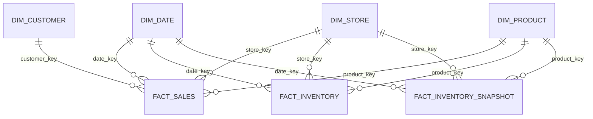
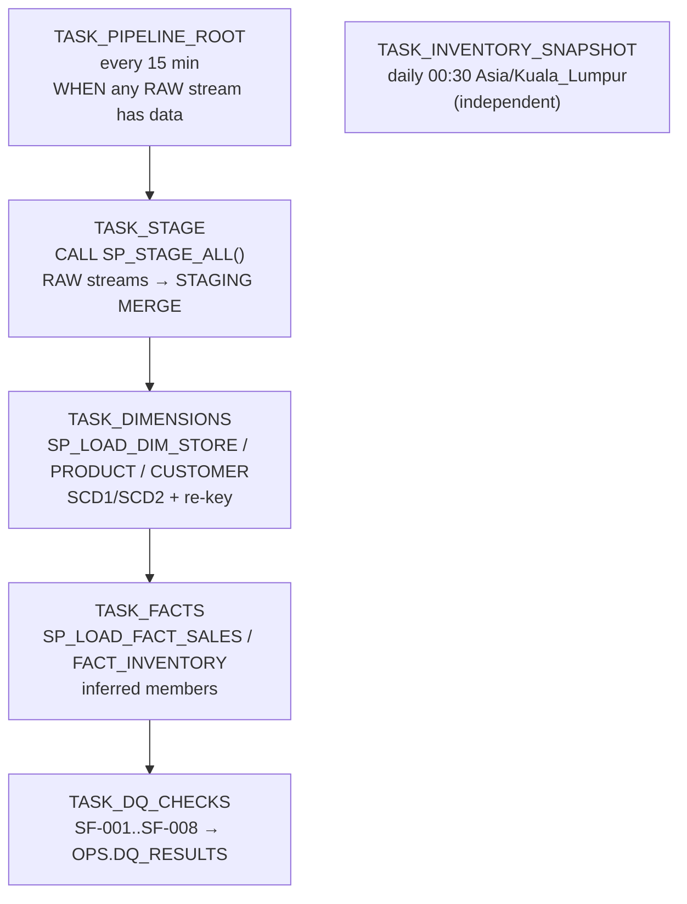

# Data Model — Snowflake Layers and Star Schema

> Status: **Accepted** (Phase 1). Decisions: [ADR-005](../adr/ADR-005-snowflake-architecture.md), [ADR-006](../adr/ADR-006-dimensional-modelling.md), [ADR-010](../adr/ADR-010-snowflake-loading.md).

## 1. Layers

Database: `RETAIL_<ENV>` (default `RETAIL_DEV`).

| Schema | Purpose | Written by | Read by | Mutability |
|---|---|---|---|---|
| `RAW` | Exactly what was ingested plus lineage. Full envelope as `VARIANT`. The long-term replay source. | loader (COPY) | transformer tasks | append-only |
| `STAGING` | Typed, flattened, deduplicated, validated; local business dates derived | transformer tasks | transformer tasks | MERGE (idempotent) |
| `ANALYTICS` | Star schema: conformed dimensions and facts; business-ready views | transformer tasks | analysts, BI | MERGE (idempotent) |
| `OPS` | Pipeline metadata: migration history, DQ results, reconciliation results | migration runner, DQ task, reconciliation CLI | engineers, monitoring | append |

**Why keep RAW if Spark already validated?** RAW is the insurance policy. If a STAGING transformation has a bug, we fix the SQL and rebuild STAGING and ANALYTICS from RAW, without touching Kafka, whose retention is only days. Because RAW keeps the full envelope as `VARIANT`, fields added by newer producers are preserved even before any consumer knows about them.

## 2. RAW

Four event tables share one column layout, which mirrors the landing-zone contract in [overview.md](overview.md#landing-zone-layout-contract-between-spark-and-the-loader):

`RAW.POS_TRANSACTIONS`, `RAW.INVENTORY_MOVEMENTS`, `RAW.CUSTOMER_EVENTS`, `RAW.PRODUCT_EVENTS`

| Column | Type |
|---|---|
| `KAFKA_TOPIC` / `KAFKA_PARTITION` / `KAFKA_OFFSET` / `KAFKA_TIMESTAMP` / `KAFKA_KEY` | VARCHAR / NUMBER / NUMBER / TIMESTAMP_NTZ / VARCHAR |
| `SCHEMA_ID` | NUMBER |
| `EVENT_ID`, `EVENT_TYPE`, `SCHEMA_VERSION`, `PRODUCER`, `CORRELATION_ID`, `CAUSATION_ID` | VARCHAR |
| `EVENT_TIMESTAMP`, `PRODUCED_AT` | TIMESTAMP_NTZ (UTC) |
| `EVENT` | VARIANT — the complete envelope |
| `DQ_WARNINGS` | ARRAY |
| `INGESTED_AT` | TIMESTAMP_NTZ (UTC, Spark processing time) |
| `SPARK_QUERY_ID`, `SPARK_BATCH_ID` | VARCHAR, NUMBER |
| `_FILE_NAME`, `_FILE_ROW_NUMBER`, `_LOADED_AT` | load lineage (COPY metadata) |

Other RAW tables: `RAW.DEAD_LETTERS` (rejected records: source topic/partition/offset, rule id, message, raw value as text), `RAW.INGEST_BATCH_AUDIT` (per Spark batch and partition: offset range, records read / valid / rejected), `RAW.STORE_REFERENCE` (store CSV).

**Streams:** one append-only stream per RAW table (`<TABLE>_STREAM`). A stream records an offset into the table's change history. Reading it inside a DML transaction returns only rows added since the last *consumed* offset, and committing advances the offset. This is Snowflake's built-in incremental processing, so no "last loaded timestamp" bookkeeping is needed.

## 3. STAGING

| Table | Grain / key | Built from | Notes |
|---|---|---|---|
| `STG_POS_TRANSACTION_LINES` | one row per (`transaction_id`, `line_number`) | `RAW.POS_TRANSACTIONS_STREAM` + `LATERAL FLATTEN(line_items)` | dedupe: first `event_id` per `transaction_id` wins; later duplicates counted (SF-002). Derives `local_ts`, `business_date`, `local_hour` using `STG_STORES.timezone` |
| `STG_INVENTORY_MOVEMENTS` | one row per `movement_id` | `RAW.INVENTORY_MOVEMENTS_STREAM` | same dedupe pattern |
| `STG_CUSTOMER_CHANGES` | one row per `event_id` | `RAW.CUSTOMER_EVENTS_STREAM` | *all* versions kept (input to SCD2) |
| `STG_PRODUCT_CHANGES` | one row per `event_id` | `RAW.PRODUCT_EVENTS_STREAM` | *all* versions kept (input to SCD2) |
| `STG_STORES` | one row per `store_id` | `RAW.STORE_REFERENCE_STREAM` | latest wins (SCD1) |

Typing rules: money → `NUMBER(12,2)`; timestamps → `TIMESTAMP_NTZ` in UTC (`_UTC` suffix) plus `TIMESTAMP_NTZ` in store-local time (`_LOCAL` suffix); unknown enum values → `'UNKNOWN'`.

STAGING tables have change tracking enabled, and streams on them feed ANALYTICS incrementally.

## 4. ANALYTICS — star schema

### Keys: surrogate vs natural

- **Natural (business) key.** The identifier from the source system (`product_id = 'SKU-10293'`). Stable meaning, but it identifies the *entity*, not a *version* of it.
- **Surrogate key.** A warehouse-assigned integer identifying one **row** of a dimension. With SCD2, one product has several rows (versions), and each needs its own key so a fact can point at the version that was true when the sale happened.

**Deterministic surrogate keys.** `product_key = MD5_NUMBER_LOWER64(product_id || '|' || TO_VARCHAR(effective_from_utc))` (same pattern for every SCD2 dimension; SCD1 dimensions hash the natural key alone). Sequences would give different keys every time we rebuild from RAW, breaking idempotent replays and making facts and dimensions from different runs incompatible. Hash keys are reproducible: the same input always gives the same key. The collision risk of 64 bits at ~10⁵ rows is negligible (~10⁻⁹).

**Reserved members** exist in every dimension:

| Key | Meaning | Used when |
|---|---|---|
| `-1` | Unknown | Natural key is null/invalid in the fact source (should not happen after validation; monitored) |
| `-2` | Not applicable | The relationship legitimately doesn't exist, e.g. **guest checkout** has no customer |

### DIM_DATE

Grain: one row per calendar date, 2020-01-01 … 2030-12-31, generated once. `date_key` = `YYYYMMDD` integer (a readable, sortable exception to "surrogate keys are meaningless", and standard practice). Attributes: date, day of week, ISO week, month, quarter, year, `is_weekend`, Malaysian public holidays (static list), fiscal period.

### DIM_STORE — SCD Type 1

| Column | Notes |
|---|---|
| `store_key` (PK), `store_id` (NK, unique) | |
| `store_name`, `city`, `state`, `region`, `store_format` (`FLAGSHIP`/`MALL`/`NEIGHBOURHOOD`/`EXPRESS`), `size_sqm`, `opened_date`, `timezone` | overwritten on change |

**Why Type 1.** Store attributes change rarely, and when a store is reassigned to a new region, the business wants history *restated* under the current structure, so "region performance" compares like with like. If as-was region reporting becomes a requirement, the change is additive: convert to Type 2.

### DIM_PRODUCT — hybrid SCD Type 2 / Type 1

| Column | SCD | Why |
|---|---|---|
| `product_key` (PK) | — | hash(product_id, effective_from) |
| `product_id` (NK) | — | |
| `category`, `subcategory`, `brand` | **2** | "Revenue by category" must use the category the product was in *when sold*; recategorisation must not rewrite last quarter's category results |
| `list_price`, `unit_cost` | **2** | Price and cost history enables margin analysis as-was and price-change impact analysis |
| `is_active` | **2** | Know when a product was discontinued (underperformer analysis) |
| `product_name`, `unit_of_measure` | 1 | Corrections (typos) should apply everywhere |
| `effective_from_utc`, `effective_to_utc`, `is_current`, `is_inferred`, `version_number`, `source_event_id` | — | version metadata; `effective_to_utc` is exclusive, `9999-12-31` for current |

### DIM_CUSTOMER — hybrid SCD Type 2 / Type 1

| Column | SCD | Why |
|---|---|---|
| `customer_key` (PK), `customer_id` (NK) | — | |
| `loyalty_tier` | **2** | Sales by the tier the customer held at purchase time; tier-migration analysis |
| `home_store_id`, `city`, `state` | **2** | Customers move; regional analysis should attribute past sales to the past location |
| `birth_year` → `age_band` (derived), `signup_date`, `marketing_opt_in`, `email_sha256` | 1 | Corrections and consent flags apply globally (consent must be current, never historical) |
| version metadata | — | as for product |

### SCD2 mechanics

For each natural key, versions come from `STG_*_CHANGES` ordered by `event_timestamp`. A new version is created only when a **Type 2 attribute actually changes**. An event that changes only Type 1 attributes (or nothing) updates the Type 1 columns of *all* versions of that key.

- `effective_from_utc` = the event time of the change. **Exception:** the first version of every key gets `1900-01-01`, so any fact, however early, finds a version.
- `effective_to_utc` = the next version's `effective_from_utc` (exclusive), or `9999-12-31`.
- **Out-of-order changes.** If an older change arrives after a newer one, the procedure rebuilds the version chain *for the affected natural keys only*, from the full `STG_*_CHANGES` history. Because keys are deterministic, unchanged versions keep their keys. Facts whose timestamp now falls into a different version are re-pointed in the same transaction (see *fact re-keying*).
- **Fact lookup (point-in-time join):** `fact.event_ts_utc >= dim.effective_from_utc AND fact.event_ts_utc < dim.effective_to_utc`.

### Late-arriving dimensions: inferred members

A sale can reference `SKU-40404` before `product.updates` has delivered that product (different topics, no cross-topic ordering). Options: reject the sale (loses revenue — wrong), use `-1` (loses the product identity), or **insert an inferred member**. We use inferred members:

1. When loading facts, any natural key missing from the dimension gets an inferred row: its first version, `effective_from = 1900-01-01`, `is_inferred = TRUE`, attributes `'Unknown'`.
2. The fact points at the inferred row's key.
3. When the real product event arrives, the SCD2 rebuild produces the first real version with **the same key** (same natural key, same `1900-01-01` effective_from), overwriting the placeholder attributes. Facts already pointing at it immediately show the right category. No fact update is needed.
4. DQ rule `SF-003` reports how many fact rows currently point at inferred members, and for how long.

### FACT_SALES — transaction fact

**Grain: one row per product line item of a completed POS transaction** (`transaction_id`, `line_number`).

| Column | Type | Kind |
|---|---|---|
| `sales_line_key` | NUMBER | PK, hash(transaction_id, line_number) |
| `date_key`, `store_key`, `product_key`, `customer_key` | NUMBER | FKs (`customer_key = -2` for guests) |
| `transaction_id`, `line_number` | VARCHAR, NUMBER | degenerate dimension (the basket) |
| `payment_method`, `register_id` | VARCHAR | degenerate attributes |
| `product_id`, `customer_id`, `store_id` | VARCHAR | durable natural keys (used for re-keying and debugging) |
| `event_ts_utc`, `event_ts_local`, `local_hour` | TIMESTAMP_NTZ, NUMBER | hourly analysis without a time dimension |
| `quantity` | NUMBER | additive |
| `unit_price` | NUMBER(12,2) | non-additive (average it, never sum it) |
| `gross_amount` = quantity × unit_price | NUMBER(12,2) | additive |
| `discount_amount` | NUMBER(12,2) | additive |
| `net_amount` = gross − discount | NUMBER(12,2) | additive (**revenue**) |
| `cost_amount` = quantity × product version `unit_cost` | NUMBER(12,2) | additive (margin) |
| `event_id`, `_loaded_at` | | lineage |

Basket metrics: `SUM(net_amount) / COUNT(DISTINCT transaction_id)`.

### FACT_INVENTORY — transaction fact (stock movements)

**Grain: one row per inventory movement event** (`movement_id`).

| Column | Kind |
|---|---|
| `inventory_movement_key` (PK, hash(movement_id)), `date_key`, `store_key`, `product_key` | keys |
| `movement_id`, `movement_type`, `reason_code`, `reference_id` | degenerate |
| `quantity_delta` | additive (net stock change) |
| `quantity_on_hand_after` | **semi-additive**: may be summed across stores/products at a point in time, never across time |
| `unit_cost`, `movement_value` = quantity_delta × cost | additive value |
| `event_ts_utc`, `event_ts_local`, `event_id`, `_loaded_at` | |

### FACT_INVENTORY_SNAPSHOT — periodic snapshot

**Grain: one row per store × product × business date** (closing position), for every store/product pair that has had any movement.

| Column | Kind |
|---|---|
| `date_key`, `store_key`, `product_key` (composite PK) | keys |
| `closing_on_hand` | **semi-additive** (use end-of-period or average over time, never sum over days) |
| `units_received`, `units_sold`, `units_adjusted` | additive for the day |
| `closing_value` | semi-additive |
| `is_below_reorder_point` | flag (reorder point = 7-day avg daily sales × 3 days cover) |

It is built by a daily task after local midnight. Days without movements carry the previous closing balance forward, so "inventory position on date X" is a simple lookup. Why a snapshot in addition to movements? Stock-on-hand for any day could be computed by summing all movements since the beginning of time, but that is expensive and error-prone for every query. The periodic snapshot is Kimball's standard answer for balances: turnover and average inventory become cheap.

## 5. Incremental processing: Streams and Tasks

- `WHEN SYSTEM$STREAM_HAS_DATA(...)` is evaluated by Snowflake's cloud services layer *without* starting a warehouse. If no new data was loaded, the run is skipped at zero warehouse cost.
- **Stored procedures are used only where a unit of work needs several statements in one transaction.** Consuming a stream and applying SCD2 (close old versions, insert new ones, re-key facts) must commit atomically, or a failure halfway would advance the stream offset and lose changes. Simple single-statement transforms are plain `MERGE`s inside the procedure or task.
- Tasks are created **suspended** and resumed explicitly (`make snowflake-tasks-resume`), so a forgotten trial account does not burn credits.

## 6. Analytics coverage

| Question | Model objects |
|---|---|
| Total revenue, revenue by outlet / product / category | `FACT_SALES.net_amount` × DIM_STORE / DIM_PRODUCT (as-was category) |
| Hourly and daily sales, sales trends | `FACT_SALES.local_hour`, DIM_DATE (day, week, month), window functions for moving averages |
| Average basket value, units per basket | `FACT_SALES` grouped by `transaction_id` |
| Units sold, top-selling and underperforming products | `FACT_SALES.quantity`, ranking; underperformers = active products in the bottom decile of units vs category peers, or with no sales in N days |
| Store performance | revenue, transactions, basket value, revenue per sqm, vs region average |
| Inventory position, low-stock products | `FACT_INVENTORY_SNAPSHOT` latest date; `is_below_reorder_point` |
| Inventory turnover | units sold ÷ average `closing_on_hand` over the period (and value-based with cost) |
| Stock movements | `FACT_INVENTORY` by `movement_type` / `reason_code` (shrinkage analysis) |
| Gross margin | `net_amount − cost_amount` |

Queries live in `snowflake/analytics/` (Phase 7).

## 7. Micro-partitions and clustering

Snowflake stores tables as immutable, compressed, columnar **micro-partitions** (50–500 MB uncompressed each) and keeps min/max metadata for every column in every micro-partition. A query filtering `WHERE date_key BETWEEN 20260901 AND 20260907` reads only the micro-partitions whose min/max range overlaps. This is **pruning**, and it is the main performance lever in Snowflake.

Our tables are loaded incrementally in roughly event-time order, so they are *naturally clustered* by date. We therefore define **no clustering keys**: automatic reclustering costs credits and pays off only for multi-terabyte tables whose natural load order doesn't match the filter columns. We will check `SYSTEM$CLUSTERING_INFORMATION` on `FACT_SALES` in Phase 7 to confirm the assumption.
