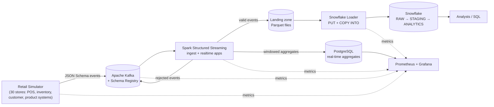
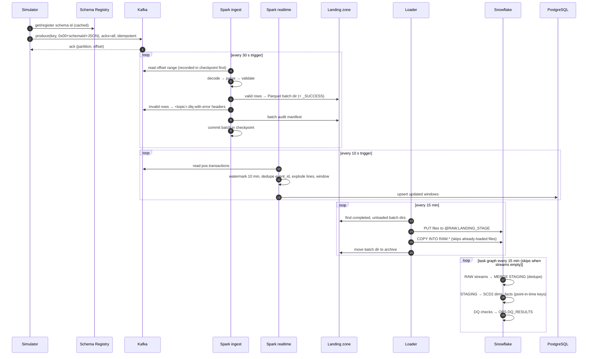

# Architecture Overview

> Status: **Accepted** (Phase 1). This document is a source of truth; implementations conform to it.
> Related: [event-contracts.md](event-contracts.md) · [kafka-topology.md](kafka-topology.md) · [data-model.md](data-model.md) · [failure-modes.md](failure-modes.md) · [ADRs](../adr/)

## 1. Purpose

**KedaiKita Retail** is a fictional Malaysian convenience/grocery chain with 30 outlets. This platform captures its operational events (point-of-sale sales, inventory movements, customer and product changes) in real time and turns them into:

1. **Operational real-time metrics** (seconds of latency): revenue per store per 5 minutes, units per product per hour.
2. **A governed analytical warehouse** (minutes of latency): a Snowflake star schema supporting revenue, basket, product, store and inventory analysis with full history.

The project is designed to demonstrate production data-engineering practice (contracts, idempotency, failure handling, data quality, observability, cost control) while running on one laptop with Snowflake as the only cloud dependency.

## 2. Requirements

### Functional

| ID | Requirement |
|---|---|
| F1 | Simulate 30 stores, ~500 products, ~20,000 customers generating POS transactions, inventory movements, customer changes and product changes. |
| F2 | Support real-time mode (current timestamps, configurable rate) and backfill mode (historical days at max speed). |
| F3 | Inject faults on demand: malformed JSON, missing fields, invalid values, duplicates, late events, unknown product references. |
| F4 | Validate every event against its contract at the producer and again in Spark; never load a record that violates a REJECT rule. |
| F5 | Route rejected records to a per-topic dead-letter topic with the reason, preserving the original bytes. Support redrive after remediation. |
| F6 | Compute streaming aggregates with event-time windows and watermarks, deduplicated by `event_id`. |
| F7 | Land every valid event, including late ones, into Snowflake RAW with Kafka lineage (topic/partition/offset). |
| F8 | Transform RAW → STAGING → ANALYTICS (star schema with SCD2 dimensions) incrementally inside Snowflake. |
| F9 | Reconcile counts end to end (Kafka → Spark → landing → RAW → STAGING → facts) and persist DQ results. |
| F10 | Provide analytical SQL for the business questions listed in [data-model.md](data-model.md#analytics-coverage). |

### Non-functional

| ID | Quality | Target (local) |
|---|---|---|
| N1 | Throughput | Sustain ≥ 500 events/s end to end on a 16 GB laptop (default simulator rate is 20 tx/s). |
| N2 | Real-time latency | P95 event → PostgreSQL aggregate < 30 s. |
| N3 | Warehouse freshness | Event → ANALYTICS fact ≤ 35 min at default schedules (configurable; a cost trade-off, see ADR-005). |
| N4 | Correctness | No silent loss: every Kafka record is accounted for as loaded, rejected (DLQ) or duplicate. |
| N5 | Idempotency | Any component can crash and restart at any point without duplicating facts. |
| N6 | Cost | Snowflake: XSMALL warehouses, 60 s auto-suspend, tasks skip when no data, resource monitor cap. |
| N7 | Operability | One command to start infrastructure; health checks; dashboards; runbooks for every failure mode. |
| N8 | Security | No committed secrets; env-based config; least-privilege Snowflake roles; key-pair auth for service users. |

### Out of scope (documented as future enhancements)

Kubernetes, Airflow/Dagster, dbt, Terraform, multi-broker Kafka locally, Kafka transactions / exactly-once Kafka-to-Kafka, CDC from a real OLTP database, returns/refunds, multi-currency, ML features.

## 3. System context



The primary analytical path is **Simulator → Kafka → Spark → Snowflake → SQL**. Two components sit between Spark and Snowflake by design:

- **Landing zone + loader** (ADR-010) decouples streaming from warehouse availability and cost: Spark never waits on Snowflake, and Snowflake compute runs only in short, scheduled load windows instead of every micro-batch.
- **PostgreSQL** (ADR-011) serves second-level operational aggregates cheaply, so that "real-time" does not mean "keep a Snowflake warehouse running 24/7".

## 4. Components and boundaries

| Component | Runtime | Responsibility | Owns / writes | Reads |
|---|---|---|---|---|
| Simulator | Python container | Generate realistic domain events; fault injection; produce to Kafka with producer-side schema validation | primary topics | reference data (package data) |
| Kafka + Schema Registry | `apache/kafka` (KRaft) + `cp-schema-registry` | Durable, ordered, replayable event log; schema storage and compatibility enforcement | — | — |
| Topic/schema bootstrap | one-shot Python container | Create topics from `topics.yaml`; register schemas and set compatibility | topics, subjects | `kafka/` |
| Spark **ingest** app | PySpark container (local mode) | Stateless per topic: decode wire format, parse, validate, route valid → landing, invalid → DLQ, write batch audit | landing zone, `*.dlq` topics | primary + `*.retry` topics |
| Spark **realtime** app | PySpark container (local mode) | Stateful: watermark, dedupe, windowed aggregates → PostgreSQL | `realtime.*` tables | `pos.transactions`, `pos.transactions.retry` |
| Snowflake loader | Python container (scheduled loop) | PUT completed landing batches to internal stage; COPY INTO RAW; archive; reference-data load | RAW tables | landing zone |
| Snowflake | Cloud | Streams + Tasks transform RAW → STAGING → ANALYTICS; DQ checks → OPS | STAGING, ANALYTICS, OPS | RAW |
| DLQ redrive CLI | Python (on demand) | Inspect DLQ; republish selected records to `*.retry` after remediation | `*.retry` topics | `*.dlq` topics |
| Reconciliation CLI | Python (on demand / scheduled) | Run cross-layer reconciliation queries, export results as metrics/logs | OPS results | Snowflake, Kafka offsets |
| Monitoring | Prometheus, Grafana, kafka-exporter | Scrape, store, visualise, alert | — | `/metrics` endpoints |

**Boundary rules**

1. Only the simulator writes to primary topics; only Spark writes to `*.dlq`; only the redrive CLI writes to `*.retry`. (Topic ownership would be enforced with ACLs in production.)
2. Spark never talks to Snowflake. The landing zone is the only interface between them.
3. Snowflake RAW is append-only and is the long-term replay source. Kafka retention is for operational replay only (days).
4. ANALYTICS is only built from STAGING; analysts only read ANALYTICS.

## 5. Data flow



### Three clocks

Every record carries three timestamps, and the platform is explicit about which one each operation uses:

| Time | Where | Used for |
|---|---|---|
| **Event time** | `metadata.event_timestamp` (set by the source system when the sale happened) | Windowing, watermarks, business dates, SCD2 effective dates |
| **Ingestion time** | Kafka record timestamp (`CreateTime`, set by producer) and `metadata.produced_at` | Producer delay diagnostics |
| **Processing time** | `current_timestamp()` in Spark, `_LOADED_AT` in Snowflake | Latency/freshness metrics, audit — never business logic |

## 6. Spark query topology

| App | Query | Source topics | Stateful? | Sink | Trigger | Checkpoint |
|---|---|---|---|---|---|---|
| ingest | `ingest_pos_transactions` | `pos.transactions`, `pos.transactions.retry` | No | landing `pos_transactions/`, DLQ `pos.transactions.dlq`, audit | 30 s | `checkpoints/ingest/pos_transactions` |
| ingest | `ingest_inventory_movements` | `inventory.events`, `inventory.events.retry` | No | landing `inventory_movements/`, DLQ, audit | 30 s | `checkpoints/ingest/inventory_movements` |
| ingest | `ingest_customer_events` | `customer.events`, `customer.events.retry` | No | landing `customer_events/`, DLQ, audit | 30 s | `checkpoints/ingest/customer_events` |
| ingest | `ingest_product_events` | `product.updates`, `product.updates.retry` | No | landing `product_events/`, DLQ, audit | 30 s | `checkpoints/ingest/product_events` |
| realtime | `rt_store_revenue_5m` | `pos.transactions`, `pos.transactions.retry` | Yes (dedupe + window) | `realtime.store_revenue_5m` | 10 s | `checkpoints/realtime/store_revenue_5m` |
| realtime | `rt_product_units_1h` | `pos.transactions`, `pos.transactions.retry` | Yes (dedupe + window) | `realtime.product_units_1h` | 10 s | `checkpoints/realtime/product_units_1h` |

**Why the ingest path is stateless.** Streaming deduplication and windowing drop records older than the watermark. The ingest path must never drop a valid record just because it is late (a till that was offline for two hours is still revenue), so it does no stateful operations. Duplicates are removed in Snowflake by `MERGE` on `event_id`, which has unbounded memory. The realtime path accepts bounded lateness in exchange for bounded state; its numbers are an operational approximation, and the warehouse is the source of financial truth.

### Landing-zone layout (contract between Spark and the loader)

```
data/landing/
  <dataset>/                              pos_transactions | inventory_movements | customer_events | product_events | dead_letters | ingest_audit
    query_id=<streaming-query-uuid>/
      batch_id=<zero-padded 12 digits>/
        part-*.parquet
        _SUCCESS                          written last; the loader ignores directories without it
data/archive/<same layout>                loaded batches (deleted after LANDING_ARCHIVE_RETENTION_DAYS)
```

`query_id` comes from the checkpoint, so resetting a checkpoint can never collide with an earlier run's `batch_id`s (see ADR-007).

**Timestamps are ISO-8601 UTC strings** (`2026-09-29T12:31:42.215000Z`), not Parquet timestamp types. Parquet timestamp encodings (INT96 vs INT64, UTC-adjusted or not) are a classic source of silent timezone shifts between engines; an explicit `Z` string is unambiguous and is parsed with an explicit format by `COPY INTO`.

**Event dataset columns** (identical for the four event datasets; Snowflake RAW mirrors them):

| Column | Type | Source |
|---|---|---|
| `kafka_topic`, `kafka_partition`, `kafka_offset`, `kafka_timestamp`, `kafka_key` | string, int, long, string (ISO-8601 UTC), string | Kafka record |
| `schema_id` | int | Confluent wire-format header |
| `event_id`, `event_type`, `schema_version`, `event_timestamp`, `produced_at`, `producer`, `correlation_id`, `causation_id` | string (timestamps as ISO-8601 UTC `…Z`) | envelope `metadata` |
| `event_json` | string | the complete envelope JSON exactly as received (becomes `VARIANT` in RAW) |
| `dq_warnings` | string (JSON array) | IDs of WARN-severity rules the record violated, e.g. `["POS-008"]` |
| `ingested_at` | string (ISO-8601 UTC) | Spark processing time |
| `spark_query_id`, `spark_batch_id` | string, long | lineage |

## 7. Deployment view (local)

| Service | Image | Host port | Health check | Depends on (healthy) | Memory limit |
|---|---|---|---|---|---|
| `kafka` | `apache/kafka:4.3.1` | 9092 | broker API versions | — | 1 GB |
| `schema-registry` | `confluentinc/cp-schema-registry:8.2.4` | 8081 | `GET /subjects` | kafka | 512 MB |
| `kafka-init` | project Python image | — | one-shot (exit 0) | kafka, schema-registry | 256 MB |
| `kafka-ui` | `ghcr.io/kafbat/kafka-ui:v1.5.0` | 8080 | `/actuator/health` | kafka, schema-registry | 512 MB |
| `postgres` | `postgres:17.11` | 5434 (`POSTGRES_HOST_PORT`; 5432/5433 are often taken) | `pg_isready` | — | 256 MB |
| `simulator` | project Python image | 8000 (metrics) | `/metrics` | kafka-init completed | 256 MB |
| `spark-ingest` | project Spark image | 4040 (UI), 8002 (metrics) | UI reachable | kafka-init completed | 2 GB |
| `spark-realtime` | project Spark image | 4041 (UI), 8003 (metrics) | UI reachable | kafka-init completed, postgres | 2 GB |
| `loader` | project Python image | 8001 (metrics) | `/metrics` | — (Snowflake is external; retries with backoff) | 256 MB |
| `kafka-exporter` | `danielqsj/kafka-exporter:v1.10.0` | 9308 | `/metrics` | kafka | 128 MB |
| `prometheus` | `prom/prometheus:v3.13.4` | 9090 | `/-/ready` | — | 256 MB |
| `grafana` | `grafana/grafana:13.0.10` | 3030 (`GRAFANA_HOST_PORT`) | `/api/health` | prometheus, postgres | 256 MB |

Compose profiles keep the default footprint small: `core` (Kafka, registry, init, UI, Postgres, monitoring), `pipeline` (simulator, Spark apps), `snowflake` (loader, only when Snowflake credentials are configured).

`depends_on: service_healthy` orders startup, but it does not prove a dependency will stay available. Every client therefore also retries connections with exponential backoff and fails with a clear error after a bounded time.

## 8. Observability

Details in ADR-009. Metric names below are a contract for dashboards and alerts.

| Metric | Type | Labels | Emitted by |
|---|---|---|---|
| `retail_producer_messages_total` | counter | topic, status (`acked`/`failed`) | simulator |
| `retail_producer_delivery_latency_seconds` | histogram | topic | simulator |
| `retail_producer_validation_failures_total` | counter | topic | simulator |
| `retail_simulator_faults_injected_total` | counter | topic, fault | simulator |
| `retail_spark_batch_duration_seconds` | gauge | query | Spark listener |
| `retail_spark_input_rows_total` | counter | query | Spark listener |
| `retail_spark_records_total` | counter | query, outcome (`valid`/`rejected`/`warned`) | Spark listener (via `observe`) |
| `retail_spark_input_rows_per_second` / `processed_rows_per_second` | gauge | query | Spark listener |
| `retail_spark_kafka_offsets_behind_latest` | gauge | query, stat (`max`/`avg`) | Spark listener (Kafka source metrics) |
| `retail_spark_event_lag_seconds` | gauge | query, stat (`max`/`avg`) | Spark listener (processing time − event time) |
| `retail_spark_state_rows` | gauge | query | Spark listener |
| `retail_spark_late_rows_dropped_total` | counter | query | Spark listener (`numRowsDroppedByWatermark`) |
| `retail_loader_files_loaded_total` | counter | dataset, status | loader |
| `retail_loader_rows_loaded_total` | counter | dataset | loader |
| `retail_loader_cycle_duration_seconds` | histogram | — | loader |
| `retail_loader_landing_backlog_batches` | gauge | dataset | loader |
| `retail_loader_last_success_timestamp_seconds` | gauge | dataset | loader |
| `kafka_consumergroup_lag`, `kafka_topic_partition_current_offset` | gauge | topic, partition | kafka-exporter (DLQ volume = rate of DLQ offsets) |

Standard log fields: `timestamp, level, service, event, event_id, transaction_id, topic, partition, offset, correlation_id, processing_time_ms, status`.

## 9. Security model (summary)

| Concern | Local | Production (documented, not built) |
|---|---|---|
| Secrets | `.env` (git-ignored), `.env.example` committed | Secrets manager (AWS Secrets Manager / Vault), workload identity |
| Snowflake auth | key-pair for service user; password only for an interactive developer user | key-pair or OAuth; SSO + MFA for humans; network policies |
| Snowflake authorisation | Roles `RETAIL_ADMIN`, `RETAIL_LOADER`, `RETAIL_TRANSFORMER`, `RETAIL_ANALYST` (ADR-005) | Same, plus masking policies on PII and access history audits |
| Kafka | PLAINTEXT on a private Docker network | SASL_SSL or mTLS, per-principal ACLs matching topic ownership, encryption at rest |
| Schema Registry | open locally | authN/Z, and only CI may register schemas |
| Input validation | producer schema validation plus Spark rule validation | the same |
| Supply chain | pinned images and `uv.lock`; pip-audit and secret scan in CI | plus image signing, SBOM, private mirrors |
| PII | simulator emits no names or emails; only `email_sha256` | data classification, masking, retention policies |

## 10. Repository structure

```
retail-streaming-platform/
├── .claude/agents/            specialist agent definitions
├── .github/workflows/         CI quality gates (no production deploys)
├── docs/
│   ├── architecture/          this folder — sources of truth
│   ├── adr/                   Architecture Decision Records
│   └── runbooks/              failure-mode runbooks (Phase 10+)
├── kafka/
│   ├── schemas/               JSON Schema contracts + examples/{valid,invalid}
│   └── config/topics.yaml     topic declarations
├── spark/config/              spark-defaults.conf, log4j2.properties
├── snowflake/
│   ├── ddl/                   account bootstrap (ACCOUNTADMIN, idempotent)
│   ├── migrations/            V###__*.sql versioned objects
│   ├── transformations/       R__*.sql procedures, views, tasks
│   ├── analytics/             business queries
│   └── quality/               DQ + reconciliation SQL
├── postgres/init/             real-time serving schema
├── monitoring/                prometheus/, grafana/
├── docker/                    Dockerfiles (python app, spark)
├── src/retail_platform/       the Python package (simulator, messaging, processing, loader, quality, …)
├── tests/{unit,contract,integration,e2e}/
├── scripts/                   developer helper scripts
├── docker-compose.yml · Makefile · pyproject.toml · uv.lock · .env.example · README.md
```

This deviates from the originally suggested layout in one deliberate way. All Python code (simulator, producers, Spark jobs, loader) lives in **one installable package under `src/`**, instead of top-level `simulator/`, `kafka/producers/` and `spark/jobs/` folders. Top-level folders keep only language-neutral assets (schemas, topic config, SQL, Spark config). Reasons (ADR-012):

- There is one import root and one dependency set, and the same code runs in every container.
- Shared code (config, logging, contracts) is not duplicated or path-hacked.
- `mypy` and `pytest` see one coherent package.
